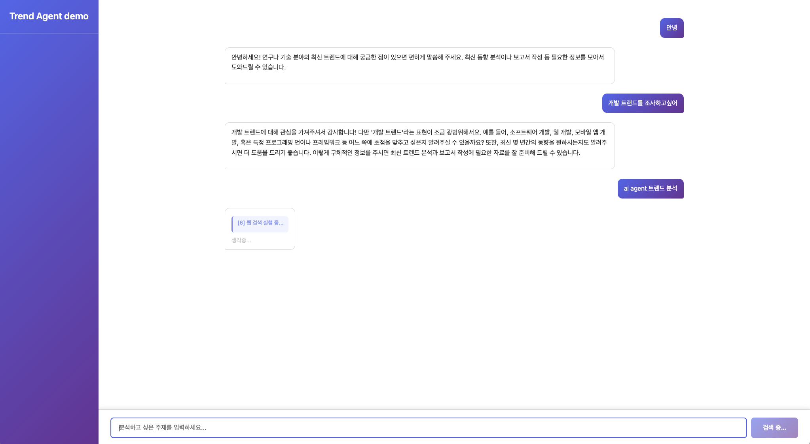
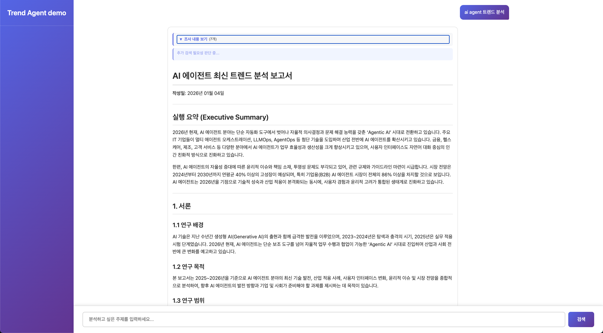
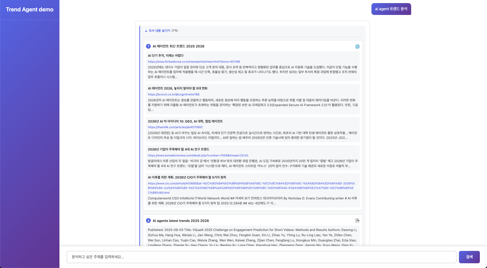

# 연구/기술 트렌드 분석 AI 에이전트

LangGraph를 활용한 연구 및 기술 트렌드 분석 전문 AI 에이전트 서비스입니다. 사용자의 요구사항을 이해하고, 최신 정보를 수집하여 전문적인 마크다운 형식의 종합 보고서를 생성합니다.

🌐 **서비스 링크**: [https://chwlabs.dev](https://chwlabs.dev)

> **참고사항**
> - 서비스 웹 페이지는 PC 웹 브라우저에 최적화되어 있습니다.
> - Agent 구조는 Langchain [`open deep research`의 에이전트 아키텍처](https://github.com/langchain-ai/open_deep_research)를 참고하였습니다.
> - Frontend는 Vanilla JS + HTML로, 바이브코딩을 활용하여 개발했습니다. 
> - README는 LLM을 활용해서 작성하였습니다. 

## 📋 목차

- [프로젝트 소개](#프로젝트-소개)
- [주요 기능](#주요-기능)
- [기술 스택](#기술-스택)
- [아키텍처](#아키텍처)
- [프로젝트 구조](#프로젝트-구조)
- [설치 및 실행](#설치-및-실행)
- [사용 예시](#사용-예시)
- [API 문서](#api-문서)

## 🎯 프로젝트 소개

### 왜 만들었는가?

>
> **주제를 선정한 개인적인 이유**: 진로의 방향을 결정하거나 연구 주제의 선정, 특정 기술의 최신 트렌드를 분석할 때 구글링이나 논문을 찾고, 다 읽어보는 등의 정보 수집 과정이 길고 찾기 어려웠다는 경험에서 출발했습니다.
> 

연구자, 개발자, 기업가들이 특정 분야의 최신 트렌드를 빠르고 정확하게 파악하는 것은 매우 중요합니다. 하지만:

- **정보의 양**: 웹과 학술 데이터베이스에 산재한 방대한 정보
- **정보의 질**: 신뢰할 수 있는 출처와 최신성 확인의 어려움
- **시간 소요**: 수동으로 정보를 수집하고 정리하는 데 드는 시간
- **전문성 요구**: 체계적인 보고서 작성 능력

이러한 문제를 해결하기 위해 **LangGraph를 활용한 AI 에이전트**를 개발했습니다. 이 에이전트는:

1. **대화형 요구사항 파악**: 사용자와 자연스러운 대화를 통해 정확한 요구사항을 도출
2. **자동 정보 수집**: 웹 검색(Tavily)과 학술 논문 검색(ArXiv)을 통해 최신 정보 수집
3. **ReAct 패턴**: LLM이 도구를 선택하고 실행하는 반복적 연구 프로세스
4. **전문 보고서 생성**: 수집된 정보를 바탕으로 구조화된 마크다운 보고서 작성

### 핵심 특징

- ✅ **LangGraph**: 서브그래프를 활용한 ReAct 패턴 구현
- ✅ **실시간 스트리밍**: SSE를 통한 연구 진행 상황 실시간 표시
- ✅ **최신 정보 우선**: 최근 1-2년간의 정보를 중점적으로 수집
- ✅ **출처 관리**: 모든 주장에 출처를 명시하여 신뢰성 확보
- ✅ **세션 관리**: 대화 컨텍스트 유지 및 자동 요약

## 🚀 주요 기능

### 1. 요구사항 명확화 (Scoping)
- 사용자와의 대화를 통해 연구 주제와 범위 파악
- 트렌드 분석 요청 여부 자동 판단
- 구조화된 출력으로 주제, 범위, 요구사항 추출

### 2. 정보 수집 (Research)
- **웹 검색**: Tavily API를 통한 최신 뉴스, 블로그, 트렌드 정보 수집
- **학술 논문 검색**: ArXiv를 통한 학술적 연구 결과 수집
- **ReAct 패턴**: LLM이 도구를 선택하고 실행하는 반복적 연구 프로세스
- 최대 3회 반복을 통해 다양한 관점의 정보 수집

### 3. 보고서 작성 (Writing)
- 수집된 정보를 바탕으로 마크다운 형식의 종합 보고서 생성
- 테이블, Mermaid 다이어그램 등 시각적 요소 포함
- 출처가 명시된 전문적인 보고서

## 🛠 기술 스택
현재는 DB 대신, 임시로 세션 기반의 멀티턴을 구현하였습니다. DB로 데이터 모델을 구성하고, 채팅방(Thread)의 CRUD를 구현하면 UI의 사이드바에서 채팅방을 관리하도록 확장할 수 있습니다. 

### Backend
- **FastAPI**: 고성능 비동기 웹 프레임워크
- **LangGraph**: 에이전트 워크플로우 관리 및 상태 관리
- **LangChain**: LLM 통합 및 도구 사용
- **OpenAI**: GPT 모델 (gpt-4o, gpt-4o-mini)
- **Tavily**: 웹 검색 API
- **ArXiv**: 학술 논문 검색
- **Pydantic**: 데이터 검증

### Frontend
- **Vanilla JavaScript**: 프레임워크 없는 순수 JavaScript
- **Marked.js**: 마크다운 파싱
- **Mermaid.js**: 다이어그램 렌더링
- **SSE (Server-Sent Events)**: 실시간 스트리밍 통신

### Infrastructure
- **Docker & Docker Compose**: 컨테이너화 및 배포
- **Nginx**: 리버스 프록시 및 정적 파일 서빙
- **AWS EC2**: 클라우드 배포
- **Uvicorn**: ASGI 서버

### Used AI Tools
- **CURSOR & context7(MCP)**: 공식문서 기반 코딩 보조
- **CODEX**: 코드 리뷰 및 리팩토링

## 🏗 아키텍처

### 전체 워크플로우

```
사용자 입력
    ↓
[clarify_requirement] → 요구사항 명확화
    ↓ (is_clarified = True)
[researcher] → 정보 수집 (ReAct 패턴)
    ├─ agent_node: LLM이 도구 선택
    ├─ tools_node: 도구 실행
    └─ 반복 (최대 3회)
    ↓
[writer] → 보고서 작성
    ↓
최종 보고서 반환
```

### LangGraph 구조

LangGraph를 사용하여 에이전트 워크플로우를 구현했습니다:

1. **clarify_requirement 노드**
   - 사용자 요구사항 분석 및 명확화
   - 구조화된 출력(Pydantic)으로 주제, 범위, 요구사항 추출
   - `Command`를 사용하여 다음 노드 지정

2. **researcher 노드 (ReAct 서브그래프)**
   - LangGraph 표준 방식으로 ReAct 패턴 구현
   - 서브그래프 내부에 `agent_node`와 `tools_node`로 분리
   - 조건부 엣지로 반복 제어
   - 최대 3회 반복을 통해 정보 수집

3. **writer 노드**
   - 수집된 findings(웹, 논문)를 바탕으로 마크다운 보고서 생성
   - 테이블, 다이어그램, 출처 포함

### ReAct 패턴 구현

`researcher` 노드 내부에서 LangGraph의 서브그래프를 사용하여 ReAct 패턴을 구현했습니다:

```python
# 서브그래프 구조
START → agent_node → (조건부) → tools_node → agent_node → ... → END
```

- **agent_node**: LLM이 도구를 선택하는 노드
- **tools_node**: 선택된 도구를 실행하는 노드
- **should_continue**: 도구 호출 여부에 따라 계속할지 종료할지 결정 (conditional edge)
- **should_continue_after_tools**: 최대 반복 횟수 체크 (conditional edge)

### 스트리밍 구조

LangGraph의 `astream_events`를 사용하여 실시간 이벤트를 감지하고 처리합니다:

- **이벤트 타입**: `on_chain_start`, `on_chain_end`, `on_tool_start`, `on_tool_end`, `on_chat_model_stream`
- **SSE 변환**: 이벤트를 SSE 형식으로 변환하여 클라이언트에 전송
- **상태 관리**: `StreamState`로 스트리밍 상태 추적

## 📁 프로젝트 구조

```
.
├── backend/                    # FastAPI 백엔드
│   ├── app/
│   │   ├── agents/            # 에이전트 관련 모듈
│   │   │   ├── graph.py       # LangGraph 그래프 정의
│   │   │   ├── runner.py      # 에이전트 실행기
│   │   │   ├── state.py       # 에이전트 상태 정의
│   │   │   ├── prompts.py     # 프롬프트 정의
│   │   │   ├── llm.py         # LLM 초기화
│   │   │   ├── utils.py       # 유틸리티 함수
│   │   │   └── nodes/         # 에이전트 노드
│   │   │       ├── scoping.py        # 요구사항 명확화
│   │   │       ├── researcher.py     # 정보 수집 (ReAct)
│   │   │       ├── writer.py         # 보고서 작성
│   │   │       └── research_tools.py # 도구 정의 및 실행
│   │   ├── api/               # API 레이어
│   │   │   ├── router.py      # FastAPI 라우터
│   │   │   ├── service.py     # 비즈니스 로직
│   │   │   ├── schemas.py     # Pydantic 스키마
│   │   │   ├── session.py     # 세션 관리
│   │   │   └── sse.py         # SSE 유틸리티
│   │   ├── core/              # 핵심 설정
│   │   │   ├── config.py      # 환경 변수 설정
│   │   │   ├── llm.py         # LLM 초기화
│   │   │   └── logging.py     # 로깅 설정
│   │   └── main.py            # FastAPI 애플리케이션
│   ├── requirements.txt       # Python 의존성
│   └── Dockerfile             # Docker 이미지
├── frontend/                   # Vanilla JS 프론트엔드
│   ├── js/
│   │   ├── sseClient.js       # SSE 클라이언트
│   │   ├── stateManager.js    # 상태 관리
│   │   ├── eventHandlers.js   # 이벤트 핸들러
│   │   ├── uiUpdater.js       # UI 업데이트
│   │   ├── messageRenderer.js # 메시지 렌더링
│   │   └── markdownUtils.js   # 마크다운/Mermaid 유틸리티
│   ├── index.html             # HTML 템플릿
│   ├── styles.css             # 스타일시트
│   └── serve.sh               # 개발 서버 스크립트
├── nginx/                      # Nginx 설정
│   ├── nginx.conf             # Nginx 설정 파일
│   └── Dockerfile             # Nginx Docker 이미지
├── docs/                       # 문서
│   ├── instruction.md        # 프로젝트 목적
│   ├── specs.md              # 명세서
│   └── planning.md           # 계획서
├── docker-compose.yml         # Docker Compose 설정
└── README.md                  # 프로젝트 README
```

## 🚀 설치 및 실행

### 사전 요구사항

- Python 3.11 이상
- Docker & Docker Compose (선택사항)
- OpenAI API Key
- Tavily API Key

### 환경 변수 설정

`backend/.env` 파일을 생성하고 다음 변수를 설정하세요:

```env
OPENAI_API_KEY=your_openai_api_key
TAVILY_API_KEY=your_tavily_api_key

# LangSmith (선택사항)
LANGCHAIN_TRACING_V2=
LANGSMITH_API_KEY=
LANGSMITH_ENDPOINT=
LANGSMITH_PROJECT=
```

### 로컬 개발 환경

### Docker로 실행 (nginx 포함)

```bash
docker-compose up -d

# 서비스는 다음 주소에서 접근 가능합니다:
# - Frontend: `http://localhost`
# - Backend API: `http://localhost/api`
```

또는 각각 실행 (아래)

#### Backend 실행

```bash
cd backend
pip install -r requirements.txt
uvicorn app.main:app --reload --port 8000
```

#### Frontend 실행

```bash
cd frontend
./serve.sh
```


## 💡 사용 예시

### UI 화면

#### 1. 요구사항 분석 및 자료 조사


사용자가 요청을 입력하면, 에이전트가 요구사항을 분석하고 관련 자료를 조사합니다. 진행 상황이 실시간으로 표시됩니다.

#### 2. 보고서 생성


수집된 정보를 바탕으로 구조화된 마크다운 형식의 종합 보고서가 생성됩니다.

#### 3. 조사 자료 확인


토글을 펼치면 조사한 자료 기록을 확인할 수 있으며, 보고서 내 출처 링크를 통해 원본 자료에 접근할 수 있습니다.


### 예시 1: AI 트렌드 분석

**사용자 입력:**
```
최근 생성형 AI의 최신 트렌드를 분석해줘
```

**에이전트 동작:**
1. 요구사항 명확화: "생성형 AI" 주제 확인
2. 정보 수집:
   - 웹 검색: "생성형 AI 최신 트렌드 2025"
   - 논문 검색: "generative AI recent trends"
   - 추가 검색: "LLM 발전 동향"
3. 보고서 작성: 수집된 정보를 바탕으로 종합 보고서 생성

**결과:**
- 최신 트렌드 요약
- 주요 기술 발전 사항
- 시장 동향 분석
- 출처가 명시된 전문 보고서

### 예시 2: 특정 기술 분야 분석

**사용자 입력:**
```
양자 컴퓨팅의 최근 발전 상황을 알려줘
```

**에이전트 동작:**
1. 요구사항 명확화: "양자 컴퓨팅" 주제 확인
2. 정보 수집:
   - 웹 검색: "양자 컴퓨팅 최신 동향"
   - 논문 검색: "quantum computing recent advances"
3. 보고서 작성: 양자 컴퓨팅의 최신 발전 상황 정리

## 📡 API 문서

### POST `/api/chat/stream`

SSE 스트리밍 채팅 요청

**Request:**
```json
{
  "session_id": "optional-session-id",
  "user_message": "최근 AI 트렌드 분석해줘"
}
```

**Response:** SSE 스트림

**이벤트 타입:**
- `session`: 세션 ID 전송
- `research_status`: 조사 상태 업데이트 (예: "[1] 웹 검색 실행: 'AI 트렌드'")
- `research_findings`: 조사 결과 (링크 및 스니펫)
- `text_chunk`: 텍스트 청크 (스트리밍)
- `scoping_complete`: 요구사항 명확화 완료
- `final`: 최종 결과

### GET `/api/sessions`

모든 세션 목록 조회

### GET `/health`

헬스 체크

## 🔍 핵심 구현 사항

### 1. LangGraph 표준 ReAct 패턴

`researcher` 노드에서 LangGraph의 서브그래프를 사용하여 ReAct 패턴을 구현했습니다:

- **서브그래프**: `StateGraph`로 agent 노드와 tools 노드 분리
- **조건부 엣지**: 도구 호출 여부에 따라 반복 제어
- **메시지 관리**: `add_messages` reducer로 메시지 자동 병합

### 2. 도구 실행 로직 분리

- `research_tools.py`: 도구 정의, 실행, 포맷팅 담당
- `researcher.py`: ReAct 그래프 구성 및 흐름 제어만 담당
- 역할 분리로 유지보수성 향상

### 3. 실시간 스트리밍

- LangGraph의 `astream_events`를 활용
- 연구 진행 상황을 실시간으로 사용자에게 전달
- 도구 실행 상태, 검색 결과 등을 즉시 표시

### 4. 세션 관리

- 대화 컨텍스트 유지
- 20개 이상의 메시지 시 자동 요약
- 세션별 대화 히스토리 관리
- 보고서 자동 요약: 보고서 작성 완료 시 긴 보고서를 300자 이내로 요약하여 세션에 저장

## 📊 성능 및 제한사항

- **최대 반복 횟수**: 연구 단계에서 최대 3회 반복
- **검색 결과 수**: 웹 검색 최대 5개, 논문 검색 최대 3개
- **응답 시간**: 주제에 따라 30초~2분 소요
- **비용**: OpenAI API 사용량에 따라 변동

## 🔧 개발 가이드

### 새로운 노드 추가

1. `backend/app/agents/nodes/`에 새 노드 파일 생성
2. `AgentState`를 입력/출력으로 하는 함수 작성
3. `backend/app/agents/graph.py`에 노드 추가 및 엣지 연결

### 새로운 도구 추가

1. `backend/app/agents/nodes/research_tools.py`에 도구 정의
2. `get_tools_map()`에 도구 추가
3. `execute_tool()`에 도구 실행 로직 추가

## 📚 참고 자료

- [LangGraph 문서](https://langchain-ai.github.io/langgraph/)
- [LangChain 문서](https://python.langchain.com/)
- [FastAPI 문서](https://fastapi.tiangolo.com/)
- [Tavily API 문서](https://docs.tavily.com/)
- [ArXiv API 문서](https://arxiv.org/help/api)

## 📝 라이선스

이 프로젝트는 사전과제 제출용으로 개발되었습니다.

## 👤 작성자

Agent 특전사 육성 프로그램 사전과제
